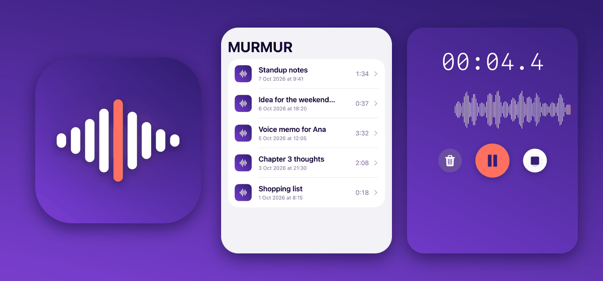
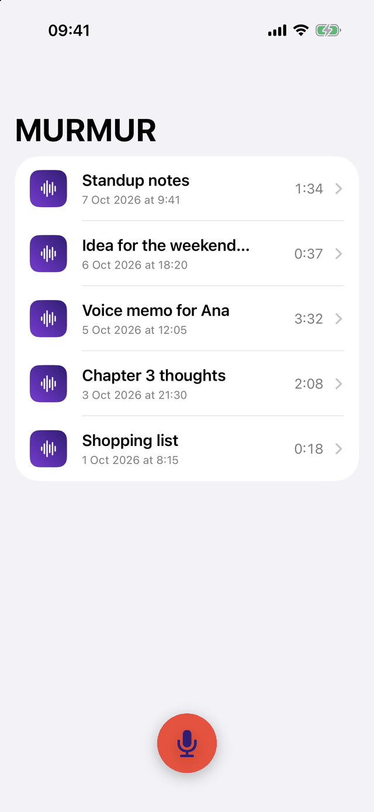
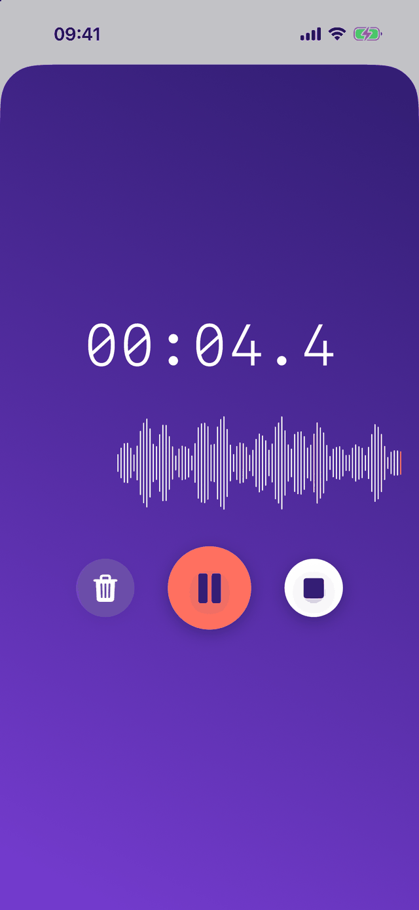
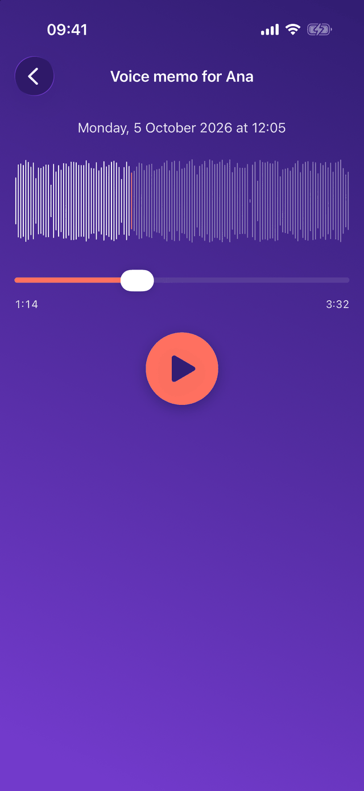
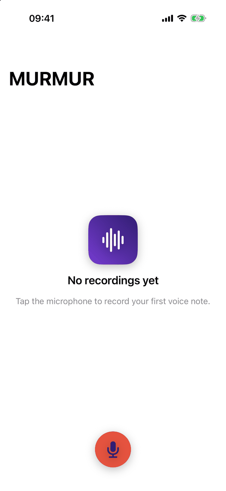
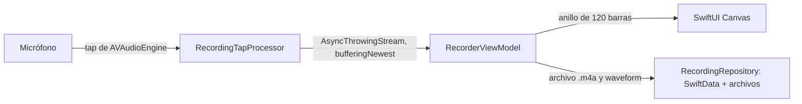

<div align="center">

# MURMUR

**Notas de voz para iPhone: grabas con un toque y ves la señal en directo mientras hablas.**

  

[Probar](#cómo-probarlo) · [Capturas](#capturas) · [Documentación](#documentación)

<a href="docs/screenshots/01-library.png">
  
</a>

</div>

MURMUR es una app nativa de iOS (SwiftUI, AVFoundation, SwiftData, sin dependencias externas) que graba notas de voz, dibuja la waveform en tiempo real y las guarda en el dispositivo. Es un proyecto técnico a propósito pequeño: el esfuerzo está en la captura de audio, el renderizado en tiempo real y el ciclo de vida de la sesión de audio. **No hay demo pública, ni TestFlight, ni App Store**: se compila con Xcode y se ejecuta en un simulador o en tu iPhone.

## Qué incluye

- **Grabar** con un toque: pausar, reanudar, parar y guardar, o descartar. Pide el permiso del micrófono al primer uso y explica qué pasa si se deniega.
- **Waveform en vivo** a 20 muestras por segundo, con memoria constante aunque la grabación dure horas.
- **Biblioteca local**: cada nota se guarda con fecha, duración y waveform, ordenada de más nueva a más antigua. Borrar elimina el audio y sus metadatos juntos.
- **Reproductor** con play, pausa, seek y la waveform completa de la nota.
- **Resistente al uso real**: llamadas, otra app que toma el audio, auriculares que se desconectan, segundo plano o permiso retirado no pierden lo ya grabado.

## Cómo probarlo

Necesitas macOS con un Xcode que incluya Swift 6 y un simulador de iOS 17 o posterior (probado con Xcode 27). No hace falta cuenta de desarrollador ni firma para el simulador.

```sh
git clone https://github.com/Cosmichomeless/MURMUR.git && cd MURMUR

# Compila la app para el simulador (solo compila; no la instala ni la abre)
xcodebuild build -project MURMUR.xcodeproj -scheme MURMUR \
  -destination 'generic/platform=iOS Simulator' -derivedDataPath build CODE_SIGNING_ALLOWED=NO

# Pasa los 157 tests (cambia el nombre si no tienes ese simulador: xcrun simctl list devices available)
xcodebuild test -project MURMUR.xcodeproj -scheme MURMUR \
  -destination 'platform=iOS Simulator,name=iPhone 17' -derivedDataPath build CODE_SIGNING_ALLOWED=NO
```

Para verla funcionando sin micrófono, con cinco grabaciones de ejemplo y una voz sintética, instálala en un simulador arrancado y lánzala en **modo demo** (solo existe en builds Debug):

```sh
xcrun simctl boot "iPhone 17" 2>/dev/null || true   # si ya hay uno arrancado, este paso no hace falta
xcrun simctl install booted build/Build/Products/Debug-iphonesimulator/MURMUR.app
xcrun simctl launch booted com.cosmichomeless.murmur -murmur-demo
```

Para usarla de verdad (micrófono real) abre `MURMUR.xcodeproj` en Xcode, elige tu equipo en *Signing & Capabilities* y ejecútala en un iPhone. Todas las opciones de la demo están en [docs/DEMO.md](docs/DEMO.md).

## Capturas

Capturas reales del simulador con los datos de la demo. Pulsa una imagen para verla a tamaño completo.

<table>
  <tr>
    <td align="center" width="50%">
      <a href="docs/screenshots/01-library.png"></a><br>
      <b>Biblioteca</b><br>Las notas, de más nueva a más antigua
    </td>
    <td align="center" width="50%">
      <a href="docs/screenshots/02-recorder.png"></a><br>
      <b>Grabador</b><br>Reloj y waveform en vivo mientras grabas
    </td>
  </tr>
  <tr>
    <td align="center" width="50%">
      <a href="docs/screenshots/03-player.png"></a><br>
      <b>Reproductor</b><br>Waveform completa, progreso y seek
    </td>
    <td align="center" width="50%">
      <a href="docs/screenshots/04-empty.png"></a><br>
      <b>Primer uso</b><br>Estado vacío, antes de la primera nota
    </td>
  </tr>
</table>

Las capturas se vuelven a tomar con `docs/screenshots/capture.sh`, que compila la app, la lanza en modo demo y optimiza los PNG (necesita un simulador arrancado y Pillow: `pip install pillow`). Solo cambia el reloj del grabador, que depende de cuándo se captura. La portada se recompone aparte, desde el icono y dos de esas capturas, con `python3 docs/screenshots/build-showcase.py`; ese script no captura la app. Más detalle en [docs/DEMO.md](docs/DEMO.md).

## Arquitectura



El audio se captura en el hilo de tiempo real, que solo calcula niveles (RMS con `vDSP`) y escribe el archivo AAC; nunca toca la interfaz ni la persistencia. Los niveles cruzan al `@MainActor` por un stream acotado, donde un view model `@Observable` alimenta la waveform en vivo y, al parar, entrega el archivo y un resumen de la waveform al repositorio. Las vistas solo pintan estado y envían intenciones; `Audio/` no importa SwiftData ni SwiftUI, y `Persistence/` no importa AVFoundation. Detalle en [docs/ARCHITECTURE.md](docs/ARCHITECTURE.md).

### Decisiones

| Decisión | Por qué | Coste |
| --- | --- | --- |
| Tap de `AVAudioEngine` en lugar de `AVAudioRecorder` | Una sola ruta da los buffers para el archivo y para el medidor, así audio y niveles no se desincronizan | Más código: el formato, el ciclo de vida del tap y los cambios de configuración son nuestros |
| Buffers acotados: stream `bufferingNewest(32)`, anillo de 120 barras, resumen de ≤ 201 barras | La memoria no depende de la duración de la grabación | Si el hilo principal se retrasa, la waveform puede saltarse una barra (el audio nunca se pierde: se escribe en el tap) |
| SwiftData para metadatos y archivos planos para el audio, con un reconciliador al arrancar | Cada herramienta hace lo que mejor sabe; una caída entre pasos se repara sola | SwiftData no borra archivos: el repositorio lo hace de forma explícita |
| Una interrupción pausa la grabación en vez de pararla | Decide la persona y la nota sigue siendo un solo archivo | El micrófono no se retoma solo, ni siquiera con `shouldResume` |
| Sin dependencias externas | Menos superficie y el proyecto trata justo de las APIs nativas | Hay que escribir cosas que una librería daría hechas |

La lista completa con su coste está en [docs/AUDIO.md](docs/AUDIO.md).

## Calidad

Cifras de una ejecución reciente en el simulador de un Mac (no son cifras de un iPhone):

- **157 tests en 25 suites**, todos en verde y sin warnings, con Swift Testing: máquina de estados del grabador (tabla completa y 20 000 eventos aleatorios con semilla), límites de los buffers, coherencia entre biblioteca y archivos (200 operaciones aleatorias, caída simulada), sesiones largas y el propio modo demo.
- **Captura**: unos 46 µs de trabajo por buffer de 23 220 µs (≈ 0,2 %); 10 minutos de audio procesados en 1,19 s.
- **Sesión larga**: una hora de muestras a 20 Hz en ≈ 0,7 s y 0,12 MB de crecimiento tras el calentamiento.
- **Render**: ≈ 0,10 ms por frame de la waveform en vivo y ≈ 0,13 ms la estática, frente a los 16,67 ms de un frame a 60 Hz.

Cómo se midió y qué significa cada cifra: [docs/PERFORMANCE.md](docs/PERFORMANCE.md). Al construir la demo se encontró y corrigió un fallo real: la waveform en vivo se congelaba tras la primera barra porque el cierre del `Canvas` no cambiaba y SwiftUI no la redibujaba (ver [notas de la versión](docs/RELEASE_NOTES.md)).

## Límites

- **No hay distribución**: ni TestFlight ni App Store, y tampoco CI. Se compila desde el código.
- **Sin probar en un iPhone físico**: interrupciones, cambios de ruta y permisos se prueban con dobles (`FakeAudioSession`), no con una llamada real ni con auriculares reales.
- Las cifras de rendimiento son de simulador, no de dispositivo.
- Solo iPhone, iOS 17 o posterior, pensada para vertical.
- Sin renombrar, buscar, compartir, exportar, carpetas, sincronización, cuentas ni transcripción: fuera de alcance a propósito.
- No hay micrófonos Bluetooth HFP: se usa el integrado.
- El modo demo y su voz sintética solo existen en builds Debug; la app real nunca los incluye.

## Documentación

| Documento | Contenido |
| --- | --- |
| [docs/PRODUCT.md](docs/PRODUCT.md) | Problema, alcance del MVP, pantallas y flujos |
| [docs/ARCHITECTURE.md](docs/ARCHITECTURE.md) | Capas, pipeline de audio, estado y concurrencia |
| [docs/AUDIO.md](docs/AUDIO.md) | Sesión de audio, interrupciones y decisiones con su coste |
| [docs/PERSISTENCE.md](docs/PERSISTENCE.md) | Modelo, archivos y consistencia |
| [docs/PERFORMANCE.md](docs/PERFORMANCE.md) | Tests y mediciones |
| [docs/DEMO.md](docs/DEMO.md) | Modo demo y cómo repetir las capturas |
| [docs/RELEASE_NOTES.md](docs/RELEASE_NOTES.md) | Notas de la versión 0.1.0 |
| [docs/PROJECT.md](docs/PROJECT.md) | Objetivos, stack y hoja de ruta original |

La documentación de `docs/` está escrita en inglés.

## Licencia

[MIT](LICENSE). Copyright © 2026 David Rodríguez.
